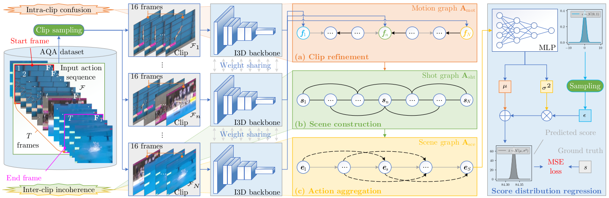

# HGCN

This is the implementation for *Hierarchical Graph Convolutional Networks for Action Quality Assessment*, which has been accepted by IEEE TCSVT. 

The framework overview is as follows:



<center>We propose a hierarchical graph convolutional network (HGCN) to address intra-clip confusion and inter-clip incoherence. First, semantic information confusion is corrected through clip refinement, generating the ‘shot’ as the basic action unit. We then construct a scene graph by combining several consecutive shots into meaningful scenes to capture local dynamics. These scenes can be viewed as different procedures of a given action, providing valuable assessment cues. The video-level representation is finally extracted via sequential action aggregation among scenes to regress the predicted score distribution, enhancing discriminative features and improving assessment performance.</center>

[Paper address](https://doi.org/https://doi.org/10.1109/TCSVT.2023.3281413) | [Project page](http://hubertshum.com/pbl_tcsvt2023aqa.htm)

## Requirements

- We provide the [dependency file](requirements.txt) of our experimental environment, one can install all dependencies by creating a new anaconda virtual environment and running:

````bash
pip install -r requirements.txt
````

- torch_videovision

```bash
pip install git+https://github.com/hassony2/torch_videovision
```

## Datasets

- MTL-AQA: Download the dataset from [the repository](https://github.com/ParitoshParmar/MTL-AQA). The data structure is:

```bash
$DATASET_ROOT
├── MTL-AQA/
    ├── new
        ├── new_total_frames_256s
            ├── 01
            ...
            └── 09
    ├── info
        ├── final_annotations_dict_with_dive_number
        ├── test_split_0.pkl
        └── train_split_0.pkl
    └── model_rgb.pth
```

- AQA-7: Download AQA-7 Dataset using the following commands:
```bash
mkdir AQA-Seven & cd AQA-Seven
wget http://rtis.oit.unlv.edu/datasets/AQA-7.zip
unzip AQA-7.zip
```
The data structure is:

```bash
$DATASET_ROOT
├── Seven/
    ├── diving-out
        ├── 001
            ├── img_00001.jpg
            ...
        ...
        └── 370
    ├── gym_vault-out
        ├── 001
            ├── img_00001.jpg
            ...
    ...

    └── Split_4
        ├── split_4_test_list.mat
        └── split_4_train_list.mat
```

- JIGSAWS: Download the dataset from the [website](https://cs.jhu.edu/~los/jigsaws/info.php).

## Training and Evaluation

The command helper is:

```bash
usage: main.py [-h] [--benchmark {MTL,Seven,JIGSAWS}] [--exp_name EXP_NAME]
               [--fix_bn FIX_BN] [--resume RESUME] [--ckpts CKPTS]
               [--class_idx {1,2,3,4,5,6}] [--use_gpu USE_GPU]
               [--device DEVICE] [--seed SEED] [--model MODEL] [--phase PHASE]
               [--config CONFIG] [--weight_decay WEIGHT_DECAY]
               [--base_lr BASE_LR] [--fold FOLD] [--bs_train BS_TRAIN]
               [--bs_test BS_TEST] [--num_groups NUM_GROUPS]
```


### Training from scratch

One can use the following command to train the model from scratch:

```bash
python main.py --benchmark MTL/Seven --phase train \
    --model models.hgcn --device 01 --exp_name default \
    --num_groups 1/2/4/8 --ckpts weights/MTL.pth
```

### Evaluation using the pretrained model

We provide the pretrained model at [Google drive](https://drive.google.com/drive/folders/1P6ZgE0DksnWBw4oJFg-vo5kY0SsWD1G_?usp=sharing). Please download it into the `./weights` folder.  One can use the following command to run the example code:

```bash
python main.py --benchmark MTL --phase test \
    --model models.hgcn --device 01 \
    --num_groups 8 --ckpts weights/MTL-group8.pth
```

## Citation

If you find our work useful in your research, please consider citing:

```latex
@article{zhou23hierarchical,
    author={Zhou, Kanglei and Ma, Yue and Shum, Hubert P. H. and Liang, Xiaohui},
    journal={IEEE Transactions on Circuits and Systems for Video Technology},
    title={Hierarchical Graph Convolutional Networks for Action Quality Assessment},
    year={2023},
    doi={10.1109/TCSVT.2023.3281413},
    issn={1051-8215},
    publisher={IEEE},
}
```

## Contact

For any questions, feel free to contact me via `zhoukanglei@qq.com`.